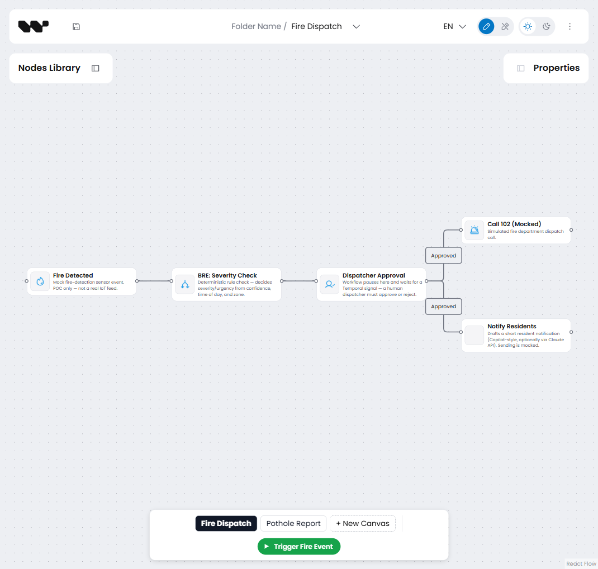
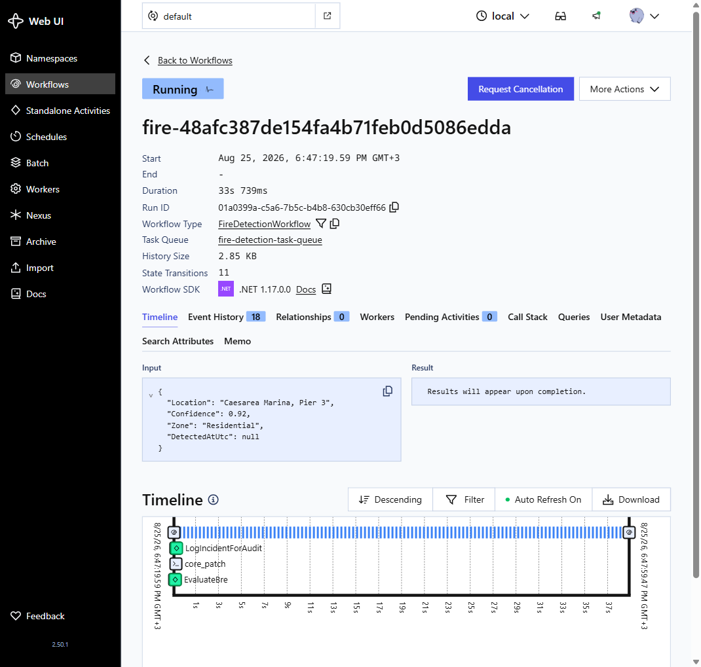
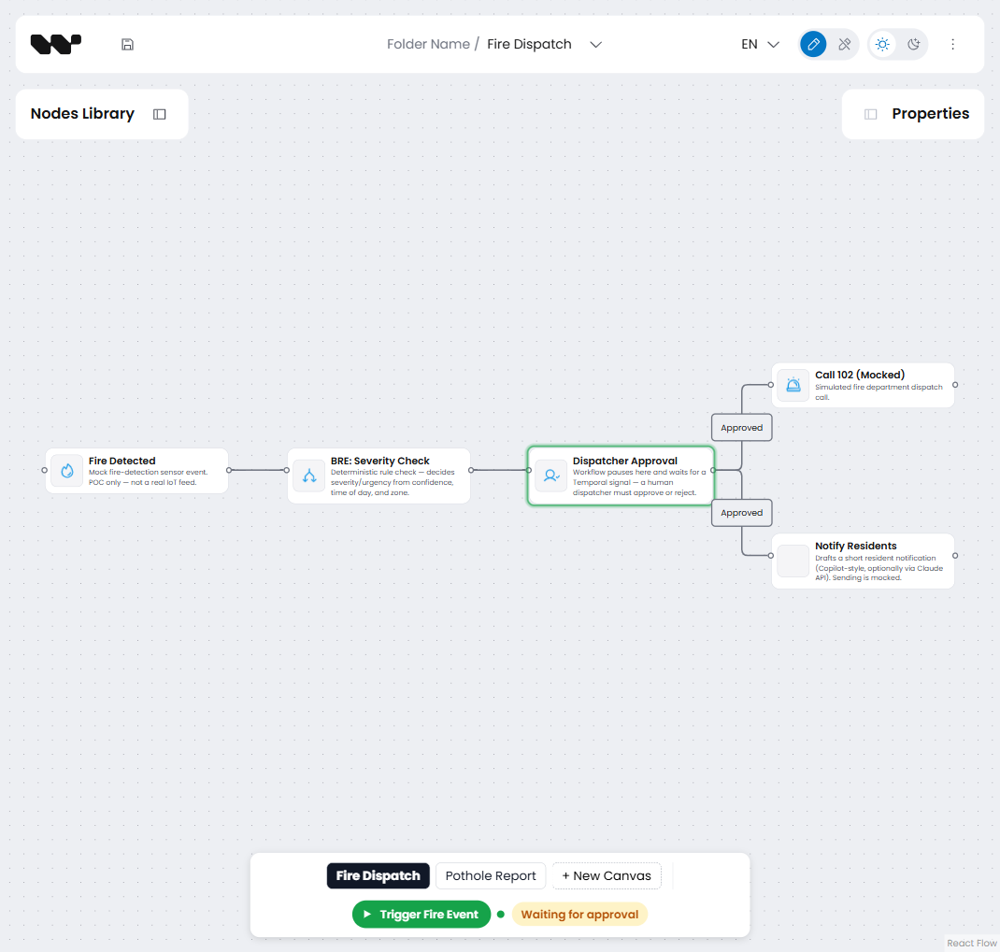
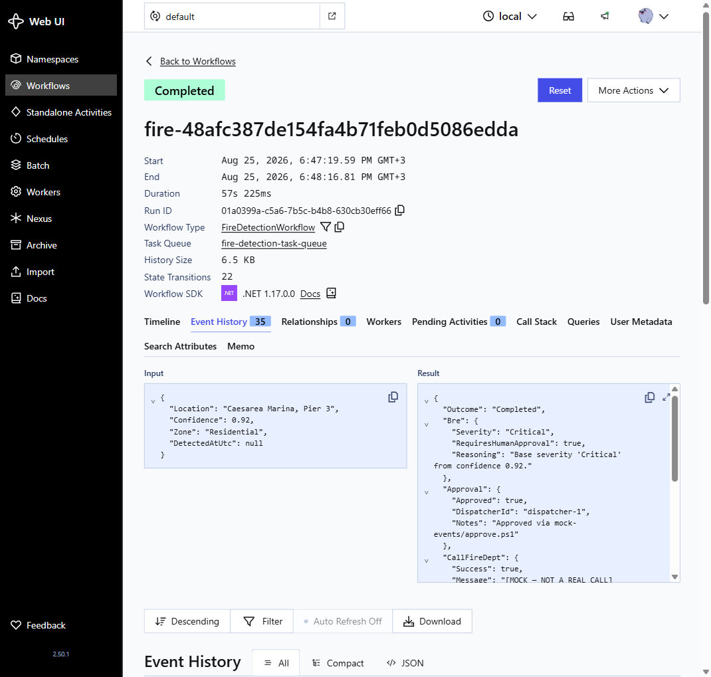
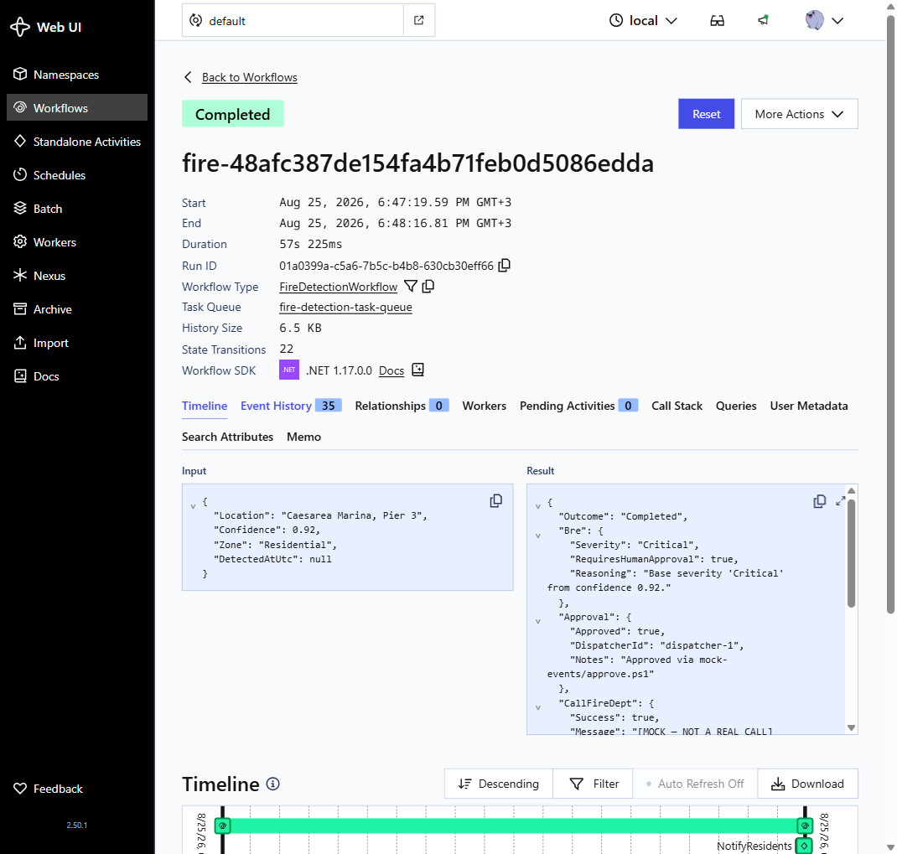

# Caesarea Smart City — Workflow Automation POC

> ## ⚠️ Proof of concept — read this before running anything
>
> - **No real emergency service, repair crew, or resident is ever contacted.**
>   Fire's "Call 102" step
>   ([FireDetectionActivities.cs](SmartCityPoc.Worker/Domains/FireDispatch/FireDetectionActivities.cs))
>   and Pothole's activities
>   ([PotholeActivities.cs](SmartCityPoc.Worker/Domains/PotholeReport/PotholeActivities.cs))
>   only write `[MOCK]`-prefixed log lines. Nothing places a phone call,
>   dispatches a real crew, or hits any external system, except optionally
>   the Claude API for drafting text — see
>   [Optional: Claude-drafted notifications](#optional-claude-drafted-notifications).
> - This is throwaway demo/learning code, built incrementally to understand
>   Temporal and a visual workflow-builder SDK (`@workflowbuilder/sdk`)
>   hands-on. It is **not** intended to be merged into, or used as a
>   foundation for, any production system. There is no auth, no real
>   persistence (everything server-side is an in-memory dictionary that
>   resets whenever `SmartCityPoc.Api` restarts), and no error-recovery beyond
>   what Temporal gives you for free.

## Architecture at a glance

This POC runs as **four separate processes** that only ever talk to each
other over the network — none of them share memory or call each other's code
directly:

```
Browser (workflow-editor)  →  SmartCityPoc.Api  →  Temporal Server  ←  SmartCityPoc.Worker
   localhost:5173              localhost:5112       localhost:7233
```

- **Temporal Server** — the durable execution engine (run via the `temporal`
  CLI). Not part of this codebase; it's a dependency, like a database.
- **`SmartCityPoc.Worker`** — hosts the actual workflow/activity *code*. It
  polls Temporal for work and executes it.
- **`SmartCityPoc.Api`** — a thin ASP.NET Core web API. It's the **only**
  piece the browser ever talks to; it translates HTTP requests into Temporal
  client calls (start workflow, send signal, query status).
- **`workflow-editor`** — the React app in your browser: the drag-and-drop
  canvas plus a few buttons that call the Api.

A **Workflow** (in Temporal terms) is orchestration code — it decides *what
happens and in what order*, and it's allowed to pause indefinitely (e.g.
`Workflow.WaitConditionAsync` waiting for a signal). An **Activity** is where
actual work happens — I/O, calling an API, anything with side effects — and
it's the unit Temporal retries on failure. Both domains follow this split.

## What this demonstrates

The real "Smart City" platform this POC stands in for is built around a
Central Hub, Domain Hubs, a Spatial Router, Digital Twins, and a Business
Rules Engine (BRE) that arbitrates automated city responses. This POC
demonstrates that architecture in miniature with **two independent workflow
domains**, both built the same way:

| Domain | Flow | BRE-equivalent step | Human-in-the-loop step | Terminal action(s) |
| --- | --- | --- | --- | --- |
| **Fire Dispatch** | Fire Detected → Call 102 | `EvaluateBreAsync` — severity from confidence/time-of-day/zone | Dispatcher Approval (signal, no timeout) | Call 102 (mock) + Notify Residents (mock) |
| **Pothole Report** | Pothole Reported → Close Ticket | `ExecuteStepAsync("assessSeverity", ...)` — Minor/Major from street name | Repair Crew Confirmation and/or Manager Approval (signal, no timeout) | Close Ticket (mock) |

Four ideas carry over directly from the real platform. Three are demonstrated
identically by both domains; the fourth now has **two different answers on
purpose** — see below.

1. **The BRE as a guardrail, not a decision-maker.** Each domain's assessment
   activity is a deterministic rule check that classifies the event — it
   never itself authorizes the terminal action.
2. **Mandatory human-in-the-loop approval.** Each workflow suspends on
   `Workflow.WaitConditionAsync`, waiting for a signal. This is a signal
   wait, **not a timeout** — the workflow sits paused indefinitely until a
   human explicitly acts. Nothing downstream runs before that happens.
3. **The audit trail is Temporal's own execution history**, not a
   custom-built log. `GET /workflows/{id}/history` returns
   `WorkflowHandle.FetchHistoryAsync()` as-is.
4. **Whether the no-code diagram and the real execution engine are the same
   artifact is a per-domain choice, and this POC deliberately shows both:**
   - **Fire Dispatch** keeps them separate. The `workflow-editor` app draws a
     picture of the flow; a human keeps that picture in sync with the actual
     Temporal workflow code by hand. Dragging and connecting nodes never
     starts or influences a real workflow — only the dedicated trigger button
     (backed by a real Api call) does that.
   - **Pothole Report** makes the diagram the source of truth. `SmartCityPoc.Api`
     reads whatever was last saved for the `pothole-report` canvas, converts
     the nodes/edges into an ordered step list, and starts a generic
     interpreter workflow (`PotholeWorkflow`) that executes exactly that list
     — see [The Pothole diagram drives real execution](#the-pothole-diagram-drives-real-execution)
     below. `PotholeWorkflow.cs` doesn't know what steps exist; it only knows
     how to run whichever ones it's handed.

   Seeing both side by side is the point: the second isn't strictly "better"
   — it's a deliberate architectural trade-off (see the boundaries called out
   below), and knowing which one you're building is exactly the kind of
   decision the real platform has to make per domain.

## Architecture: the domain-module pattern

Both the Worker and the visual editor are organized so that **onboarding a
new workflow domain never requires touching shared code** — this is the
pattern worth showing as how the real, bigger platform would be structured.
See [Folder structure](#folder-structure) below — specifically
["The pattern that ties it all together"](#the-pattern-that-ties-it-all-together-generic-platform--domain-plug-ins)
— for exactly how this works and where each piece lives.

The visual editor also supports **multiple canvases** — see
[Multi-canvas system](#multi-canvas-system) — each scoped to whichever node
types it's given, following the same "generic shell + domain-specific
content" split.

## How triggering becomes "real" in production

The "Trigger Mock X Event" buttons in the editor are **not** the real trigger
mechanism — they're a human standing in for whatever *should* call the Api.
`POST /events/fire` and `POST /events/pothole`
([Program.cs](SmartCityPoc.Api/Program.cs)) just take JSON and start a
workflow; the endpoint has no idea whether the caller was a browser button or
an automated system. **That Api layer is the entire seam between "demo" and
"production"** — nothing about Temporal, the Worker, or the editor changes
when the trigger source changes:

- **Fire Dispatch**: real sensors → an ingestion path (IoT Hub, MQTT, etc.) →
  a small consumer service that translates telemetry into a `FireEvent` and
  calls `POST /events/fire`.
- **Pothole Report**: a citizen-facing app calling `POST /events/pothole`
  directly on submission, or an automated road-inspection image-recognition
  pipeline.
- **General pattern**: a message queue/event bus, with a thin "event bridge"
  service per source system translating that source's events into the right
  Api call. Adding a new source system is then purely an ingestion-side
  change — no Temporal code touched.
- **Recurring/scheduled triggers** (e.g. "poll sensor readings every 5
  minutes") use Temporal's own native Schedules feature — a different,
  separate mechanism from webhook-style event triggers.

## Folder structure

```
SmartCityPoc.slnx              .NET solution file (Api + Worker + Shared)
SmartCityPoc.Shared/            DTOs shared by the Api and Worker
SmartCityPoc.Worker/            Temporal worker: hosts one worker per task queue, runs both domains' code
SmartCityPoc.Api/                ASP.NET Core API: starts workflows, signals approval/repair, exposes status/history
workflow-editor/                Vite + React 19 + TypeScript app embedding the @workflowbuilder/sdk visual editor
mock-events/                    PowerShell scripts to drive the Fire Dispatch demo without the UI
```

### `SmartCityPoc.Shared/` — the contract between Api and Worker

Plain C# records/enums, no logic. Both other .NET projects reference this one
so they agree on shapes without duplicating them:

- `FireEvent`, `ApprovalSignal`, `BreResult` — Fire Dispatch's data shapes
- `StepDefinition`, `StepKind`, `PotholeStatus` — Pothole Report's data
  shapes (`StepDefinition` is what a saved diagram gets converted into)
- `TaskQueues.cs` — the two Temporal task-queue name constants
  (`fire-detection-task-queue`, `pothole-report-task-queue`) — a task queue
  is how Temporal knows which Worker process should pick up which workflow

### `SmartCityPoc.Worker/` — where the actual workflow logic lives

```
SmartCityPoc.Worker/
  Program.cs                    registers both workers (below)
  Domains/
    FireDispatch/
      FireDetectionWorkflow.cs    the [Workflow] class — orchestration logic
      FireDetectionActivities.cs  the [Activity] methods — actual "work"
    PotholeReport/
      PotholeWorkflow.cs          a generic step-list interpreter (not hardcoded steps)
      PotholeActivities.cs        one dispatch method (ExecuteStepAsync) handling all step types
```

`Program.cs` registers **two independent Temporal workers in one process** —
one per task queue, one per domain:

```csharp
builder.Services
    .AddHostedTemporalWorker(clientTargetHost: "localhost:7233", clientNamespace: "default",
        taskQueue: TaskQueues.FireDetection)
    .AddScopedActivities<FireDetectionActivities>()
    .AddWorkflow<FireDetectionWorkflow>();

builder.Services
    .AddHostedTemporalWorker(clientTargetHost: "localhost:7233", clientNamespace: "default",
        taskQueue: TaskQueues.PotholeReport)
    .AddScopedActivities<PotholeActivities>()
    .AddWorkflow<PotholeWorkflow>();
```

The two domains are built two different ways on purpose — the interesting
architectural point of this repo:

- **Fire Dispatch**: `FireDetectionWorkflow` has a fixed, hardcoded sequence
  of steps written in C#.
- **Pothole Report**: `PotholeWorkflow` doesn't know its own steps — it's
  handed a `List<StepDefinition>` as a workflow argument and just loops over
  whatever it's given, dispatching each by `StepKind` (Trigger/Activity/Wait).
  That list comes from whatever was drawn on the canvas.

### `SmartCityPoc.Api/` — the seam between browser and Temporal

Two files only:

- **`Program.cs`** — every HTTP endpoint (`/events/fire`, `/events/pothole`,
  `/workflows/{id}/approve`, `/workflows/{id}/status`,
  `/workflows/{id}/history`, plus the `/api/workflow-diagrams/{canvasId}`
  save/load endpoints). Each one is a few lines that call into the Temporal
  .NET client (`StartWorkflowAsync`, `SignalAsync`, `QueryAsync`,
  `DescribeAsync`).
- **`PotholeDiagramConverter.cs`** — the one piece of real logic here: walks
  a saved diagram's nodes/edges and turns them into the
  `List<StepDefinition>` passed to `PotholeWorkflow`.

Everything the Api stores (saved diagrams, canvas list) is an **in-memory
`Dictionary`** — it resets whenever this process restarts. Temporal
workflow state is *not* affected by that; only "what's drawn on the canvas"
is.

### `workflow-editor/` — the React app

```
workflow-editor/src/
  App.tsx              the generic shell — renders <WorkflowBuilder.Root>, knows
                          nothing about "Fire Dispatch" or "Pothole Report"
  platform/            generic infrastructure — knows NOTHING domain-specific
    workflow-domain.ts    the "WorkflowDomain" contract every domain must implement
    domain-registry.ts    the list of registered domains
    canvas-store.ts       which canvases exist, which one is active (zustand store)
    node-registry.ts      resolves node-type keys → actual palette item definitions
    StatusPoller.tsx      polls /workflows/{id}/status every 500ms
    StatusBadge.tsx       renders that status as a colored pill
    live-highlight.tsx    draws the glowing ring on the currently-executing node
  domains/
    fire-dispatch/       Fire's node definitions, pre-built diagram, trigger button
    pothole-report/      Pothole's node definitions, controls panel, live-highlight wiring
```

`App.tsx` just renders the third-party drag/drop canvas library
(`<WorkflowBuilder.Root>`) pointed at whichever canvas is active, wired to
the Api's load/save endpoints via its `integration` prop — it never imports
anything from `domains/`.

### The pattern that ties it all together: "generic platform + domain plug-ins"

Both the Worker and the editor are split the same way: a thin generic layer
that knows nothing domain-specific, plus self-contained domain folders that
plug into it. Adding a third domain (say "Streetlight Outage") means: a new
`Domains/StreetlightOutage/` folder in the Worker, a new
`domains/streetlight-outage/` folder in the editor, and one import line in a
registry file each side. **No shared/platform file changes.** That's the
thing this repo is built to demonstrate.

## Request walkthrough: what happens on one click

1. You drag nodes onto the canvas → `WorkflowBuilder.Root`'s internal state
   changes (nothing hits the network yet).
2. Click **Save** → SDK POSTs the diagram JSON to
   `Api`'s `/api/workflow-diagrams/pothole-report` → stored in an in-memory
   `Dictionary`.
3. Click **Trigger** → editor calls `POST /events/pothole` → `Program.cs`
   reads that saved diagram, `PotholeDiagramConverter` turns it into a
   `List<StepDefinition>`, then calls
   `client.StartWorkflowAsync("PotholeWorkflow", [street, steps], ...)`
   against Temporal.
4. Temporal Server durably records "this workflow started" and hands the
   task to whichever Worker is polling `pothole-report-task-queue`.
5. `PotholeWorkflow.RunAsync` runs in the Worker process, looping over the
   step list, calling into `PotholeActivities` for real work, and pausing on
   `Workflow.WaitConditionAsync` for Wait-kind steps.
6. Editor polls `GET /workflows/{id}/status` every 500ms → shows the live
   ring + status pill.
7. Click **Approve** → `POST /workflows/{id}/approve-current` →
   `handle.SignalAsync(...)` → wakes the paused workflow.

## Run instructions

Run these in order, each in its own terminal.

### 1. Start the Temporal dev server

```powershell
temporal server start-dev
```

This starts Temporal (server + built-in Web UI) on `localhost:7233`, with the
Web UI at [http://localhost:8233](http://localhost:8233).

> If `temporal` isn't recognized, open a **new** shell — a winget install
> updates the PATH but shells opened before the install won't see it. If it's
> still missing, fall back to Docker:
> ```powershell
> docker run --rm -p 7233:7233 -p 8233:8233 temporalio/admin-tools temporal server start-dev --ip 0.0.0.0
> ```

### 2. Start the Worker

```powershell
dotnet run --project SmartCityPoc.Worker
```

Hosts two independent workers in one process — one per task queue, one per
domain (`fire-detection-task-queue`, `pothole-report-task-queue`).

### 3. Start the Api

```powershell
dotnet run --project SmartCityPoc.Api
```

Listens on `http://localhost:5112` (see `SmartCityPoc.Api/Properties/launchSettings.json`).

### 4. Start the visual editor

```powershell
cd workflow-editor
npm run dev
```

Open the printed `http://localhost:5173` URL. A floating bar at the
bottom-center of the screen lets you switch between the two default
canvases — **Fire Dispatch** (loads the pre-built 5-node diagram) and
**Pothole Report** (starts blank; drag its 4 node types onto the canvas
yourself) — and create new ones (see
[Multi-canvas system](#multi-canvas-system)).

### 5a. Trigger a fire event

On the **Fire Dispatch** canvas, either:

- Click **"Trigger Mock Fire Event"** in the editor's top app bar (posts a
  hardcoded mock payload and shows the returned workflow ID inline), **or**
- Run:
  ```powershell
  ./mock-events/send-fire-event.ps1
  ```

Copy the printed **workflow ID**, then approve or reject it:

```powershell
./mock-events/approve.ps1 -WorkflowId <id>
```

The workflow sits at `AwaitingHumanApproval` until you run this (or pass
`-Approved:$false` to reject it instead).

### 5b. Trigger a pothole report

On the **Pothole Report** canvas, drag a "Pothole Reported" node onto the
canvas, edit its "Street" field if you like, then click **"Trigger Pothole
Report (from canvas)"** in the floating bar — it reads the street value
straight off that node and starts a real workflow. Click **"Approve Current
Step"** (shows the workflow ID it'll signal) once you're ready to let it past
whichever wait step it's paused on. The floating bar also shows a green ring
around whichever node matches the workflow's real, currently-polled phase —
a live status indicator driven by an actual Temporal query, not a simulation.

Equivalent without the UI:

```powershell
$start = Invoke-RestMethod -Uri http://localhost:5112/events/pothole -Method Post -ContentType 'application/json' -Body '{"street":"Third Ave"}'
Invoke-RestMethod -Uri "http://localhost:5112/workflows/$($start.workflowId)/approve-current" -Method Post
```

### The Pothole diagram drives real execution

Unlike Fire Dispatch, **what you draw on the Pothole Report canvas is what
runs.** `POST /events/pothole` loads whatever diagram was last saved for that
canvas (`PotholeDiagramConverter.cs`), walks it from the "Pothole Reported"
node following its edges, and turns it into the exact step list
`PotholeWorkflow` executes. If nothing has been saved yet, it falls back to a
default list matching the flow described above (Assess Severity → Repair
Crew Confirmation → Close Ticket), so a completely fresh run behaves the same
as before this existed.

To see this for real — no C# changes required:

1. On the Pothole Report canvas, lay out **Pothole Reported → Assess
   Severity → Manager Approval → Close Ticket** (drag "Manager Approval" from
   the palette; it's new) and connect the arrows in that order.
2. Click **Save**.
3. Trigger a new pothole report (step 5b above). Watch the live-highlight
   ring stop on **Manager Approval** — a step that exists only because it was
   just drawn — instead of running straight through to Close Ticket.
4. Click **Approve Current Step** to let it continue; it closes the ticket
   and completes.

`PotholeWorkflow.cs` and `PotholeActivities.cs` are not touched between step
3 and step 4, or at any point in this exercise. That works because "wait for
a human signal" is implemented once, generically (`StepKind.Wait` in
`SmartCityPoc.Shared/StepDefinition.cs`), and both "Repair Crew Confirmation"
and "Manager Approval" are just two different nodes of that same kind — the
**"Approve Current Step"** button and the `/workflows/{id}/approve-current`
endpoint always resolve to whichever step the workflow is actually paused on
via its `GetStatus` query, rather than a hardcoded signal name.

**Honest boundaries, not hidden ones:**

- The diagram must be a single straight chain from the "Pothole Reported"
  node — no branches, no cycles. `PotholeDiagramConverter` rejects anything
  else with a clear 400 response instead of guessing.
- Only node types already listed in `PotholeStepCatalog` are executable.
  Adding another **Wait**-kind step (like this demo) needs zero backend
  changes. Inventing a genuinely new **Activity** behavior — not just
  reordering or adding already-known steps — still means adding a case to
  `PotholeActivities.ExecuteStepAsync` and an entry to the catalog. This is
  an honest low-code limit, not a scripting engine.
- Fire Dispatch is intentionally **not** converted to this pattern — see
  point 4 in [What this demonstrates](#what-this-demonstrates).
- Node properties are read as strings only (matches every current field:
  `street`, `rule`, `note`, `closureNote`).

### 6. Check the audit trail

```powershell
./mock-events/get-history.ps1 -WorkflowId <id>
```

Or, for any workflow ID from either domain:

```powershell
Invoke-RestMethod -Uri "http://localhost:5112/workflows/<id>/history"
```

Or open the Temporal Web UI at [http://localhost:8233](http://localhost:8233)
and find the workflow by ID — same history, shown visually.

## Checklist: does this POC actually do the thing?

This section runs through the 9 things a Temporal-backed visual-workflow POC
is supposed to prove, one at a time. Each one gets: the requirement in plain
English, exactly what in this repo makes it true, and how to see it for
yourself — with a real screenshot or a real terminal transcript captured
while building this, not a mockup.

### 1. Builder UI — drag/drop steps and connect them

**What this means:** a human should be able to visually assemble a workflow
— drag node shapes onto a canvas, draw arrows between them — without writing
code.

**What we did:** `workflow-editor` embeds `@workflowbuilder/sdk`'s
`<WorkflowBuilder.Root>` component (`App.tsx`), fed a palette of node types
per domain (`src/domains/*/nodes/*.ts`). This is a real drag/drop/connect
canvas library, not a static picture — every node in the palette below was
dragged onto the canvas and wired up by hand while testing this.

**How to check it:** open [http://localhost:5173](http://localhost:5173),
pick a canvas (Fire Dispatch or Pothole Report) at the bottom, drag a node
from "Nodes Library" onto the grid, and drag from one node's edge-handle to
another's to connect them.



### 2. Save — can you save that workflow definition somewhere?

**What this means:** whatever gets drawn needs to persist somewhere the
backend can read it back later — not just live in the browser tab.

**What we did:** the SDK's `integration.strategy: 'api'` (`App.tsx`) points
`load`/`save` at `GET`/`POST /api/workflow-diagrams/{canvasId}`
(`SmartCityPoc.Api/Program.cs`). Every drag/drop/connect action eventually
POSTs the whole diagram as JSON; it's stored server-side keyed by canvas ID.
(POC-scope honesty: it's an in-memory `Dictionary`, so it resets if the Api
process restarts — see the warning at the top of this README. That's a
persistence-*backend* choice, not a missing feature; swapping in a real
database wouldn't change anything above this layer.)

**How to check it:** after saving in the browser, ask the Api directly for
what it has — this is a real response captured from this repo, not a
sample:

```powershell
PS> Invoke-RestMethod http://localhost:5112/api/workflow-diagrams/fire-dispatch | ConvertTo-Json -Depth 10 | Select-Object -First 20
{
    "name": "Fire Dispatch",
    "globalVariables": {},
    "nodes": [
        {
            "id": "fire-trigger-1",
            "type": "node",
            "position": { "x": 0, "y": 120 },
            "data": {
                "segments": [],
                "type": "fireTrigger",
                "icon": "Fire",
                "properties": {
                    "label": "Fire Detected",
                    "description": "Mock fire-detection sensor event. POC only — not a real IoT feed.",
                    "status": "active",
                    "location": "Caesarea Marina, Pier 3",
```

### 3. Run — can the backend take that definition and start a real Temporal Workflow?

**What this means:** clicking "trigger" shouldn't just animate the UI — it
needs to hand off to a real, durable execution engine.

**What we did:** `POST /events/fire` and `POST /events/pothole`
(`Program.cs`) call `client.StartWorkflowAsync(...)` against a live Temporal
server — the real .NET Temporal client, not a simulation. Pothole Report
goes one step further: it reads whatever diagram was last saved
(`PotholeDiagramConverter.ConvertToSteps`) and passes that exact step list
as the workflow's input, so what you drew is genuinely what runs (see
[The Pothole diagram drives real execution](#the-pothole-diagram-drives-real-execution)).

**How to check it:** trigger an event, then look at Temporal's own Web UI —
if it's not there, it's not a real workflow. This screenshot is Temporal's
Web UI itself, showing `fire-48afc387de154fa4b71feb0d5086edda` mid-run: real
input JSON, the real `fire-detection-task-queue`, and a live timeline of
activities as they execute:



### 4. Wait — can Temporal pause for a long time without holding an HTTP request or process open?

**What this means:** "wait for operator approval" could mean minutes or
days. A naive implementation (a blocked HTTP thread, a polling loop holding
a connection) would be a resource leak or a timeout risk. Temporal's whole
pitch is that a workflow can `await` indefinitely for free.

**What we did:** every wait point is `await Workflow.WaitConditionAsync(() => _approval != null)`
(`FireDetectionWorkflow.cs`) or the equivalent for Pothole's step-kind
`Wait`. This isn't a timer, and it isn't a poll loop — it's Temporal
suspending the workflow entirely (no thread, no open connection, no memory
footprint on the Worker) until a signal arrives. Proven earlier in this
README's crash test (#6): the workflow survives even with **zero Worker
processes running at all** — there's nothing to "hold open" because nothing
is blocked.

**How to check it:** trigger an event and don't approve it. The screenshot
below is the editor moments after triggering — the canvas node glows to
show live execution state, and the status pill reads **"Waiting for
approval"**, sourced from a real Temporal query, not a hardcoded string:



Leave it like that for as long as you want — an hour, a day — and it costs
nothing. Nothing is polling in a loop; Temporal wakes the workflow only when
a signal actually arrives.

### 5. Human action — click "Approve" and have it reach the running workflow

**What this means:** a person needs a way to inject a decision into an
*already-running* workflow instance — not start a new one, not pass a flag
at trigger time, but talk to the specific paused instance from step 4.

**What we did:** `POST /workflows/{id}/approve` and
`/workflows/{id}/approve-current` (`Program.cs`) call
`handle.SignalAsync("Approve", ...)` — a real Temporal Signal, the
mechanism built exactly for "tell a running workflow something." The
handler side is `[WorkflowSignal] public Task ApproveAsync(ApprovalSignal signal)`
(`FireDetectionWorkflow.cs`), which just flips the field that
`WaitConditionAsync` above is watching. The HTTP call returns immediately
after the signal is delivered — it does **not** wait for the workflow to
finish reacting to it.

**How to check it:** Pothole Report has a dedicated **"Approve Current
Step"** button in the UI. Fire Dispatch's diagram is intentionally
decorative (see point 4 in [What this demonstrates](#what-this-demonstrates)),
so its approval is a real signal call via script or `Invoke-RestMethod` —
same underlying mechanism either way:

```powershell
PS> Invoke-RestMethod -Method Post -Uri http://localhost:5112/workflows/fire-48afc387de154fa4b71feb0d5086edda/approve `
    -ContentType "application/json" `
    -Body '{"approved":true,"dispatcherId":"dispatcher-1","notes":"Approved via mock-events/approve.ps1"}'
# 200 OK, empty body — no output on success
```

...and the workflow's own result, fetched afterward from Temporal, proves
the signal's payload actually reached it and shaped the outcome (trimmed to
the relevant fields — the real result also includes the BRE severity and
mock dispatch/notification details):

```json
{
  "Outcome": "Completed",
  "Approval": {
    "Approved": true,
    "DispatcherId": "dispatcher-1",
    "Notes": "Approved via mock-events/approve.ps1"
  }
}
```

### 6. Crash test — kill the worker while waiting, restart it, confirm the workflow resumes

**What this means:** the single biggest promise of Temporal over "just write
the state machine yourself" is that a crashed/redeployed worker doesn't lose
in-flight work. This needs to be proven, not assumed.

**What we did:** nothing — this is a property of Temporal itself, not
something this repo's code builds. The workflow's state lives on the
Temporal server (as event history), completely independent of whether any
Worker process is currently alive to execute it.

**How to check it (this exact transcript was captured live while building
this POC):**

1. Trigger a Pothole report, let it reach "Waiting for approval".
2. Kill the Worker process entirely — not the Api, not Temporal server.
3. Ask Temporal directly whether the workflow is still alive, with **zero
   workers running**:

```
$ temporal workflow describe --workflow-id pothole-e329dfa5f4144f90af1b88d562957d4d --output json | grep status
  "workflowExecutionInfo": {
    "status": "WORKFLOW_EXECUTION_STATUS_RUNNING"
```

   Still `RUNNING`. Nothing crashed, nothing was lost — the workflow simply
   has no worker to hand its next task to yet. (Asking it a *fine-grained*
   question — its custom phase query — does fail while no worker is
   polling, since a Query is a synchronous RPC a live worker must answer;
   that's the honest distinction between "the workflow is durable" [always
   true] and "we can currently ask it detailed questions" [needs a live
   worker]. The status endpoint degrades gracefully to a plain "Running"
   in that window instead of hanging or erroring.)

4. Restart the Worker (`dotnet run --project SmartCityPoc.Worker`). Within
   a couple of polls:

```powershell
PS> Invoke-RestMethod http://localhost:5112/workflows/pothole-e329dfa5f4144f90af1b88d562957d4d/status | ConvertTo-Json -Compress
{"phase":"repairWait","currentStepId":"n4","executionStatus":"Running","displayStatus":"Waiting for approval"}
```

   Back to "Waiting for approval" — the **exact same step** it was paused
   on before the crash.

5. Approve it:

```powershell
PS> Invoke-RestMethod -Method Post http://localhost:5112/workflows/pothole-e329dfa5f4144f90af1b88d562957d4d/approve-current
PS> Invoke-RestMethod http://localhost:5112/workflows/pothole-e329dfa5f4144f90af1b88d562957d4d/status | ConvertTo-Json -Compress
{"phase":"completed","currentStepId":null,"executionStatus":"Completed","displayStatus":"Completed"}
```

   Completes normally. The Worker's death and restart were invisible to the
   workflow's eventual outcome.

### 7. Retry test — one fake Activity fails twice, succeeds on the third attempt

**What this means:** transient failures (a flaky downstream API, a network
blip) shouldn't fail the whole workflow — Temporal's retry policies should
handle them automatically, without any app code implementing its own
retry-loop-with-backoff.

**What we did:** a dedicated node, **"Notify Utility Company"**
(`src/domains/pothole-report/nodes/notify-utility.ts`), dispatches to
`PotholeActivities.ExecuteStepAsync`'s `case "notifyUtility"`
(`PotholeActivities.cs`), which deliberately throws on attempts 1 and 2 and
succeeds on attempt 3 — reading Temporal's own
`ActivityExecutionContext.Current.Info.Attempt` counter, not app-level
state (so it's correct even if the Worker restarts mid-retry, per #6
above). The retry itself is driven entirely by a `RetryPolicy` attached to
`PotholeWorkflow`'s `ExecuteActivityAsync` call — no `try`/`catch`-and-loop
anywhere in this codebase.

**How to check it:** drag "Notify Utility Company" into a Pothole Report
diagram, save, trigger it, and watch the **Worker terminal** — this exact
sequence was captured live from the Worker's own stdout while testing this
from the actual browser UI:

```
[17:54:34] warn: SmartCityPoc.Worker.Domains.PotholeReport.PotholeActivities[0]
      Notify utility company attempt 1 failed (simulated) for Main St.
[17:54:34] warn: Temporalio.Activity:ExecuteStep[0]
      Completing activity ExecuteStep as failed
      Temporalio.Exceptions.ApplicationFailureException: Simulated utility-company API failure (attempt 1).
[17:54:35] warn: SmartCityPoc.Worker.Domains.PotholeReport.PotholeActivities[0]
      Notify utility company attempt 2 failed (simulated) for Main St.
[17:54:35] warn: Temporalio.Activity:ExecuteStep[0]
      Completing activity ExecuteStep as failed
      Temporalio.Exceptions.ApplicationFailureException: Simulated utility-company API failure (attempt 2).
[17:54:37] info: SmartCityPoc.Worker.Domains.PotholeReport.PotholeActivities[0]
      Utility company notified about pothole on Main St (succeeded on attempt 3).
[17:54:39] info: SmartCityPoc.Worker.Domains.PotholeReport.PotholeActivities[0]
      Repair crew closed the ticket for Main St (severity was 'Utility company notified about pothole on Main St (succeeded on attempt 3).').
```

Then open the workflow in the [Temporal Web UI](http://localhost:8233) and
expand the `ExecuteStep` activity event — its attempt count reads **3**,
which is the actual proof the retries were driven by Temporal's engine
(visible in its own execution record), not by application code faking it.

### 8. History/status — Running, Waiting for approval, Completed, Failed, from the UI

**What this means:** an operator glancing at the UI should be able to tell
at a glance whether a workflow is running, stuck waiting on a human,
finished, or broken — and there should be a full audit trail behind that
summary.

**What we did:** `GET /workflows/{id}/status` (`Program.cs`) combines two
real Temporal signals into one `displayStatus` field: `handle.DescribeAsync()`
(Temporal's own execution status — Running/Completed/Failed/...) plus, while
Running, the domain's own phase query (to distinguish plain "Running" from
"Waiting for approval"). `platform/StatusBadge.tsx` renders that as a
colored pill in the editor, fed by `platform/StatusPoller.tsx` polling every
500ms. Separately, `GET /workflows/{id}/history` returns
`handle.FetchHistoryAsync()` completely as-is — the audit trail **is**
Temporal's own execution history, not a custom-built log table.

**How to check it:** the status pill is visible in every screenshot above
next to the trigger button (Running / Waiting for approval / Completed).
For the underlying history, open the workflow in
[Temporal's Web UI](http://localhost:8233) and click **Event History** —
real output, 35 events for one fire-dispatch run, fully downloadable/
filterable:



And the "Completed" state plus the workflow's actual typed result (proving
the approval payload from #5 flowed all the way through):



### 9. Versioning — can workflow code change safely while instances are mid-flight?

**What this means:** a workflow can be paused for a long time (see #4).
If you deploy new workflow *code* while some instances are still paused
under the old code, Temporal replays each instance's history against the
new code to resume it — and if the new code doesn't match what actually
happened, that replay fails with a nondeterminism error. Versioning is the
mechanism for changing workflow code safely despite that.

**What we did:** `FireDetectionWorkflow.cs` guards a step added after the
original flow ("log incident for audit") with
`Workflow.Patched("add-incident-audit-log")`:

```csharp
if (Workflow.Patched("add-incident-audit-log"))
{
    _phase = "LoggingIncidentForAudit";
    await Workflow.ExecuteActivityAsync(
        (FireDetectionActivities act) => act.LogIncidentForAuditAsync(fireEvent, _bre), ...);
}
```

- A workflow **started before** this code shipped has no
  `add-incident-audit-log` marker in its history. Replaying it under the
  new code takes the `false` branch, skipping the new step — replay matches
  what actually happened, no error.
- A workflow **started after** this code shipped takes the `true` branch,
  runs the new step, and records the marker so every future replay agrees.

**How to check it (this was actually done, not just described, while
building this feature — same Worker process, same task queue, both
outcomes proven side by side):**

1. Started a fire workflow under the pre-patch code, left it paused at
   "Waiting for approval" — deliberately *not* approved yet.
2. Added the `Workflow.Patched` block above, rebuilt, restarted the Worker
   (same process that now has to replay that already-paused workflow's
   history under new code).
3. Approved the **old** workflow. Its full Worker log for that approval:

```
[16:45:35] warn: SmartCityPoc.Worker.Domains.FireDispatch.FireDetectionActivities[0]
      [MOCK — NOT A REAL CALL] Simulated dispatch to fire department for 'Old Town Market' at severity 'High'. No real emergency service was contacted.
[16:45:35] info: SmartCityPoc.Worker.Domains.FireDispatch.FireDetectionActivities[0]
      [MOCK SEND] Notifying residents (template): Fire reported near Old Town Market ...
```

   No `[AUDIT]` line — it correctly took the `Patched` **false** branch and
   completed cleanly. No nondeterminism error.

4. Started a **new** fire workflow (no pre-patch history at all) and
   approved it:

```
[16:45:58] info: SmartCityPoc.Worker.Domains.FireDispatch.FireDetectionActivities[0]
      BRE evaluated fire event at New Harbor District: Critical (Base severity 'Critical' from confidence 0.90.)
[16:45:58] info: SmartCityPoc.Worker.Domains.FireDispatch.FireDetectionActivities[0]
      [AUDIT] Incident logged for compliance: 'New Harbor District', severity 'Critical'.
```

   Ran the new step, since it took the `Patched` **true** branch.

Both outcomes, from the same Worker binary, depending only on whether each
individual workflow's own history predates the patch. `Workflow.DeprecatePatch`
(not called yet in this repo) is the follow-up step for once every
pre-patch workflow has finished — see the doc comment in
`FireDetectionWorkflow.cs`.

To reproduce the *failure* this guards against: revert the `Workflow.Patched`
check to an unconditional step, rebuild, restart the Worker while an
old-code workflow is still paused, and approve it — Temporal fails that
workflow's next workflow task with a nondeterminism error, because replay
no longer matches history.

## Multi-canvas system

The editor's floating bottom bar includes a canvas switcher: **Fire
Dispatch** and **Pothole Report** are the two default canvases (one per
registered domain), and **"+ New Canvas"** lets you create more, each scoped
to whichever node types you check off.

A few things worth knowing about how this actually works:

- Switching canvases fully unmounts and remounts the editor
  (`key={activeCanvas.id}` in `App.tsx`) rather than keeping multiple
  instances alive — the SDK's internal state is a shared singleton meant for
  exactly one mounted instance at a time, not several simultaneously.
- Each canvas's diagram (nodes/edges you've placed) persists independently in
  the Api, keyed by canvas ID (`GET/POST /api/workflow-diagrams/{canvasId}`)
  — in memory only, so it resets when `SmartCityPoc.Api` restarts. For the
  `pothole-report` canvas specifically, this isn't just a picture — it's read
  back and executed on the next trigger; see
  [The Pothole diagram drives real execution](#the-pothole-diagram-drives-real-execution).
- A canvas you create via "+ New Canvas" is **generic**: it gets whichever
  node types you picked, but none of Fire's or Pothole's bespoke wiring (no
  trigger button, no live-status highlight). That's an honest boundary, not
  a missing feature — connecting a canvas to real Temporal execution is
  hand-written integration code per domain (a plugin reading node data and
  calling an Api endpoint), not something free-form canvas creation can
  generate automatically. Wiring up a new canvas for real is the same kind of
  work as Pothole Report's domain folder — see
  [Architecture: the domain-module pattern](#architecture-the-domain-module-pattern).

## Optional: Claude-drafted notifications

By default, `NotifyResidentsAsync` fills in a hardcoded text template — no
network call happens. If you set the `ANTHROPIC_API_KEY` environment
variable before starting `SmartCityPoc.Worker`, that activity instead calls
the real Claude Messages API (model `claude-haiku-4-5`) to draft the
resident notification text, falling back to the template on any error. In
both cases, the "send" is still just a mock log line — no message is ever
delivered to a real resident.

```powershell
$env:ANTHROPIC_API_KEY = "sk-ant-..."
dotnet run --project SmartCityPoc.Worker
```

## mock-events/ scripts

Cross-platform (git-bash / macOS / Linux) equivalents using `curl` are given
as a comment at the top of each script. These cover **Fire Dispatch only** —
Pothole Report's equivalent endpoints (`/events/pothole`,
`/workflows/{id}/approve-current`) don't have dedicated scripts yet; call
them directly with `Invoke-RestMethod` as shown in
[step 5b](#5b-trigger-a-pothole-report) above.

| Script | Purpose |
| --- | --- |
| `send-fire-event.ps1` | POSTs a mock `FireEvent` to `/events/fire`, starts a new workflow, prints its ID |
| `approve.ps1 -WorkflowId <id>` | POSTs an `ApprovalSignal` to `/workflows/{id}/approve` (approve or `-Approved:$false` to reject) |
| `get-history.ps1 -WorkflowId <id>` | GETs `/workflows/{id}/history` and pretty-prints the Temporal execution history |

All three accept an `-ApiBaseUrl` override (default `http://localhost:5112`).
